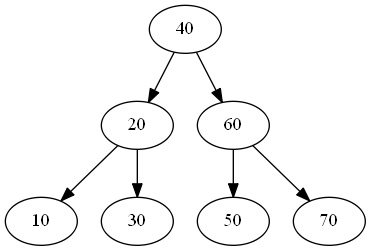
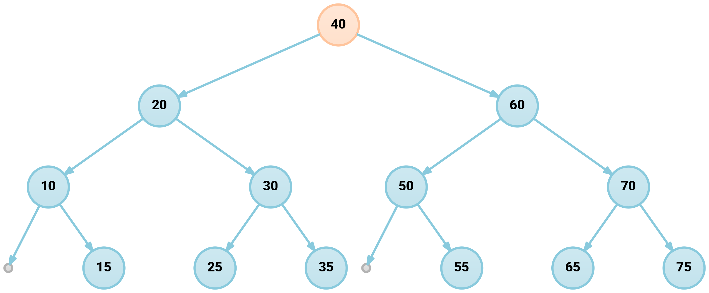
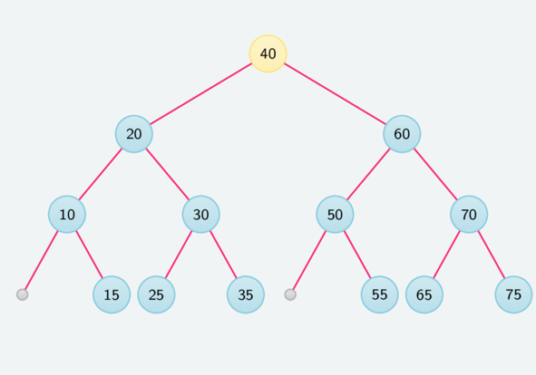
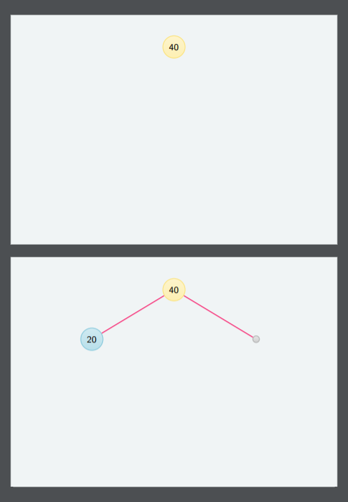

# Wizualizacja drzew binarnych

> ###### Materiały pomocnicze do zadania domowego #3 (AISDI 2019Z)
> ###### [Przykłady DOT/LaTeX/TikZ](#przykłady-składni-dot-i-latextikz) | [Skrypt generujący wizualizacje](#generowanie-obrazów-na-podstawie-zapisu-tablicowego-drzewa)

Repozytorium zawiera przykłady generowania wizualizacji drzew binarnych w pakietach ***Graphviz*** i ***LaTeX*** oraz skrypt automatyzujący tworzenie wizualizacji na podstawie zapisu tablicowego drzewa.

## Przykłady składni DOT i LaTeX/TikZ

| Graphviz | Graphviz | LaTeX/TikZ |
| ------------ | ------------ | ------------ |
|  |  |  |
| <sub>[examples/dot/tree_basic.dot](examples/dot/tree_basic.dot)</sub> | <sub>[examples/dot/tree.dot](examples/dot/tree.dot)</sub> |  <sub>[examples/latex/tree.tex](examples/latex/tree.tex)</sub> |

## Generowanie obrazów na podstawie zapisu tablicowego drzewa

### Wymagania

- **Python 3.6+**
- **GNU make** - pakiet [`build-essential`](https://packages.ubuntu.com/bionic/build-essential)
- **GNU m4** - pakiet [`m4`](https://packages.ubuntu.com/bionic/m4)
- **ImageMagick** - pakiet [`imagemagick`](https://packages.ubuntu.com/bionic/imagemagick)
- **Ghostscript** - pakiet [`ghostscript`](https://packages.ubuntu.com/bionic/ghostscript)
- **XeLaTeX**/**TikZ** - pakiety [`texlive-xetex`](https://packages.ubuntu.com/bionic/texlive-xetex), [`texlive-pictures`](https://packages.ubuntu.com/bionic/texlive-pictures)

Instalacja pakietów Python:
```console
foo@bar:~$ pip3 install -r requirements.txt
```
### Użycie

#### Zapis drzewa

Zapis przykładowego drzewa znajduje się w pliku wejściowym [`tree.bt`](tree.bt):

- każda linia pliku wejściowego przedstawia stan drzewa po wykonaniu kolejnych operacji,
- linia zawiera oddzielone białymi znakami pola z kluczami - liczby całkowite w przedziale `(0, 200)`,
- węzeł `[i]` ma lewe dziecko w polu `[2*i + 1]` i prawe dziecko w polu `[2*i + 2]`,
- puste dzieci oznaczane są przez pole `--`.

###### Przykład

Drzewo następującej postaci:

```
                40 
              /    \
             /      \
            /        \
          20          60
         /  \        /  \
        /    \      /    \
       10    --    50    --
```
powinno zostać przedstawione w pliku `tree.bt` jako:

```
40 20 60 10 -- 50 --
```

#### Wywołanie skryptu

**Wersja TL;DR**

Z katalogu `homework-3-trees`:

```console
foo@bar:~$ make
```

**Wersja dłuższa**

Wywołanie z katalogu `homework-3-trees`:

```console
foo@bar:~$ python3 visualize.py tree.bt
```

powinno wygenerować w katalogach `images` i `images/frames` pliki źródłowe `.tex`. Plik `images/tree.tex` zawiera instrukcje scalające poszczególne wizualizacje zawarte w `images/frames/*.tex`.

Przetworzenia plików `.tex` na `.pdf` można dokonać za pomocą:

```console
foo@bar:~$ xelatex -output-directory=images/frames images/frames/tree-00.tex
```

Proces ten powinien wykonać się automatycznie dla wszystkich plików za pomocą wywołania `make clean_latex` lub `make`.

### Generowanie obrazów bez instalacji XeLaTeX-a

Pliki `images/frames/*.tex` wygenerowane za pomocą skryptu można również przetworzyć na pojedynczy PDF bezpośrednio w serwisie [**Overleaf**](https://www.overleaf.com/).

W tym celu należy przekleić zawartość pierwszego pliku `images/frames/tree-00.tex` i uzupełnić ją o wycięte fragmenty środowisk `tikzpicture` z kolejnych plików. Dla klasy `standalone` z włączoną opcją `tikz` poszczególne środowiska `tikzpicture` będą wyświetlały się jako oddzielne strony wynikowego pliku.

###### Przykład

```latex
\documentclass[crop,tikz,10pt]{standalone}

\usepackage{xcolor}

\definecolor{background}{HTML}{F0F4F5}
\definecolor{border}{HTML}{D3E0E3}

\definecolor{blue}{HTML}{1395ba}
\definecolor{dark_blue}{HTML}{0e708c}

\definecolor{pink}{HTML}{f8216e}
\definecolor{dark_pink}{HTML}{b3174e}

\definecolor{yellow}{HTML}{f8ca00}
\definecolor{orange}{HTML}{ff8a39}

\definecolor{green}{HTML}{4fa400}
\definecolor{dark_green}{HTML}{306400}


\usepackage{tikz}
\usetikzlibrary{
    arrows,
    backgrounds,
    positioning,
}

\begin{document}

\begin{tikzpicture}[%
    scale=1.0,
    node distance=0.5cm,
    every node/.style={minimum size=0, inner sep=0},
    on grid,
    background rectangle/.style={draw=border!80!black,fill=background},
    show background rectangle,
    inner frame sep=0.5cm,
    level/.style={
        sibling distance = 5cm/#1,
        level distance = 1.5cm
    },
    every node/.style={
        font=\sffamily\footnotesize,
        circle,
        minimum size=0.6cm,
        line width=0.025cm,
        draw=blue!50,
        top color=blue!20,
        bottom color=blue!30,
    },
    root/.style={
        draw=yellow!50,
        top color=yellow!20,
        bottom color=yellow!30,
    },
    null/.style={
        minimum size=0.2cm,
        inner sep=0,
        draw=black!30,
        top color=black!10,
        bottom color=black!20,
    },
    edge from parent/.style={
        draw,
        pink,
        thick
    }
]

\clip (0, 0) rectangle (10.0, 7.0);

\node [root] at (5, 6) {40}
    
;
 
\end{tikzpicture}


\begin{tikzpicture}[%
    scale=1.0,
    node distance=0.5cm,
    every node/.style={minimum size=0, inner sep=0},
    on grid,
    background rectangle/.style={draw=border!80!black,fill=background},
    show background rectangle,
    inner frame sep=0.5cm,
    level/.style={
        sibling distance = 5cm/#1,
        level distance = 1.5cm
    },
    every node/.style={
        font=\sffamily\footnotesize,
        circle,
        minimum size=0.6cm,
        line width=0.025cm,
        draw=blue!50,
        top color=blue!20,
        bottom color=blue!30,
    },
    root/.style={
        draw=yellow!50,
        top color=yellow!20,
        bottom color=yellow!30,
    },
    null/.style={
        minimum size=0.2cm,
        inner sep=0,
        draw=black!30,
        top color=black!10,
        bottom color=black!20,
    },
    edge from parent/.style={
        draw,
        pink,
        thick
    }
]

\clip (0, 0) rectangle (10.0, 7.0);

\node [root] at (5, 6) {40}
    child {
        node {20} 
    }
    child {
        node [null] {}
    }
    
;
 
\end{tikzpicture}

\end{document}
```


